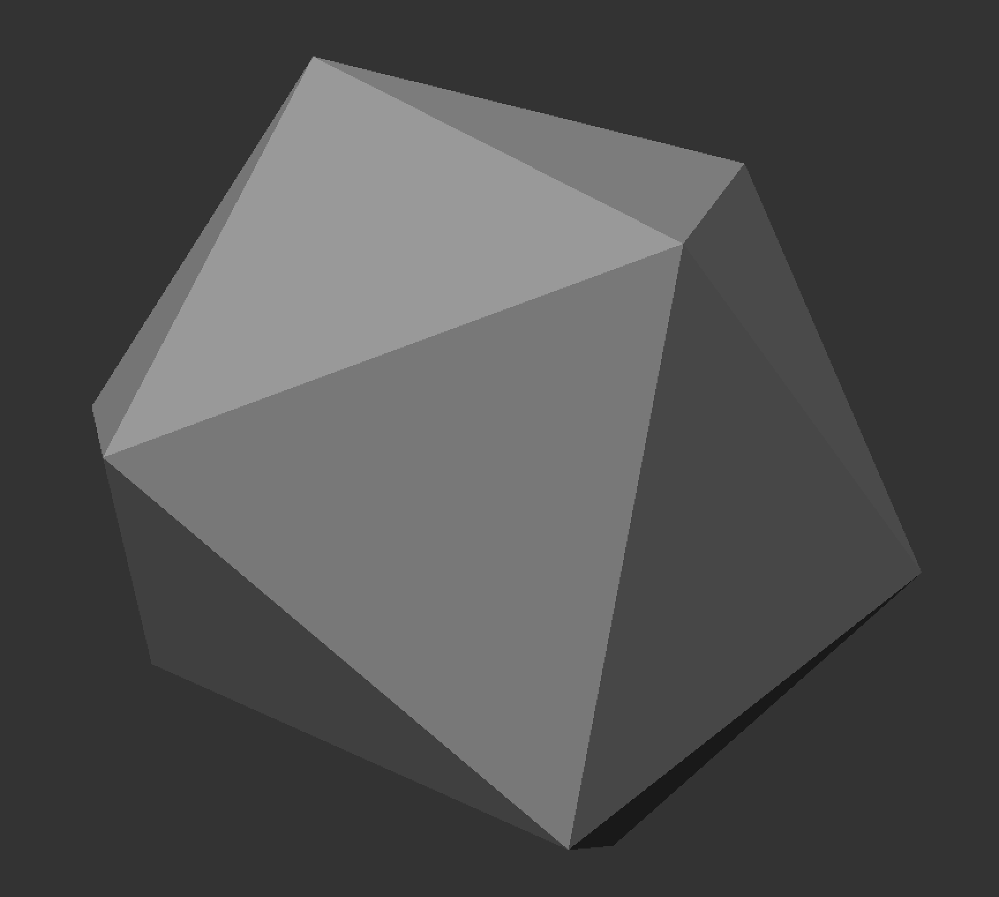

# Convexhull_3d
A header only C89 implementation of the 3-D quickhull algorithm for building Convex Hulls. The code is largely derived from the "computational-geometry-toolbox" by George Papazafeiropoulos (c) 2014, which was originally written for MatLab and distributed under the BSD (2-clause) license.

## Getting Started

To use this 3-D convexhull implementation in a '.c' or '.cpp' file , simply add the following:

```c
#define CONVEXHULL_3D_ENABLE
#include "convexhull_3d.h"
```

Then specify the vertices, which can be optionally extracted from an '.obj' file using the following code:

```c
ch_vertex* vertices = NULL;
int nVertices;
extractVerticesFromObjFile(OBJ_FILE_NAME, &vertices, &nVertices);
```

Where 'OBJ_FILE_NAME' is the '.obj' file path (without the extention).

The convexhull may then be built and subsequently exported using this code:
```c
int* out_faces = NULL;
int nFaces;
convhull_3d_build(vertices, nVertices, &out_faces, &nFaces);
convhull_3d_export_obj(vertices, nVertices, out_faces, nFaces, 1, OUTPUT_OBJ_FILE_NAME);
```

Where 'OUTPUT_OBJ_FILE_NAME' is the output '.obj' file path, without the extention.

### Additional options

By default, the algorithm uses double floating point precision to build the hull, but it still exports the results in floating point precision. However, one may configure it to use single precision to build the hull (which is less accurate but quicker) by adding the following:
```c
#define CONVEXHULL_3D_USE_FLOAT_PRECISION /* (optional) */
#define CONVEXHULL_3D_ENABLE
#include "convexhull_3d.h"
```

Also, if your project has CBLAS linked, then you can also speed the matrix multiplications up a tad by adding:
```c
#define CONVEXHULL_3D_USE_CBLAS /* (optional) */
#define CONVEXHULL_3D_USE_FLOAT_PRECISION /* (optional) */
#define CONVEXHULL_3D_ENABLE
#include "convexhull_3d.h"
```

## Test

This repository contains files: 'test/test_convexhull_3d.c' and 'test/test_script.m'. The former can be used to generate convexhulls of the '.obj' files in 'test/obj_files', which can be subsequently verified in MatLab using the latter file.


## Examples

The 'test/test_convexhull_3d.c' file may also serve as example usage of the convexhull_3d implementation. The following images are depictions of the generated .obj files, using Tim Maxwell's "OBJ Viewer":




## License

The code is distributed under the MIT license, but contains code that was originally written by MatLab by George Papazafeiropoulos (c) 2014; which was distributed under the BSD (2-clause) license.

## Contact

If you have any questions, or spot any bugs, please email: leo.mccormack@aalto.fi
